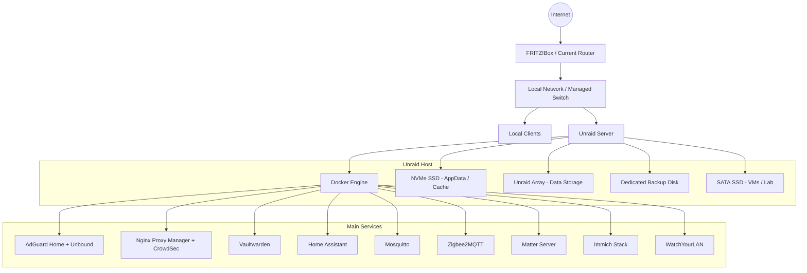

## Kurzbeschreibung

Dieses Repository dokumentiert mein privates Unraid-basiertes Homelab.
Der Fokus liegt auf Storage-Design, Docker-Services, Backup-Strategie,
internem DNS, Reverse Proxying, VPN-first Zugriff und einer geplanten
VLAN-/Firewall-Segmentierung mit UniFi.

# Unraid Homelab Infrastructure

This repository documents my Unraid-based homelab.

The setup is used as a practical learning environment for system administration, self-hosting, backups, internal DNS, reverse proxying and security-focused network design. It is not meant to look like a finished enterprise environment. It is a real homelab that I use, maintain and improve over time.

The main focus areas are:

- Unraid storage design
- Docker-based services
- AppData and share backups
- VPN-first remote access
- Internal DNS and reverse proxying
- Smart home infrastructure
- Planned UniFi-based firewall and VLAN segmentation

---

## Current Status

| Area | Status |
|---|---|
| Unraid server | Running |
| Docker services | Running |
| Internal DNS | Implemented with AdGuard Home and Unbound |
| Internal reverse proxy | Implemented with Nginx Proxy Manager |
| VPN-first remote access | Implemented |
| Local backups | Implemented for AppData and selected shares |
| Offsite backup | Planned |
| Array parity | Planned with an 8 TB or larger parity disk |
| UniFi gateway/firewall | Planned |
| VLAN segmentation | Planned |

---

## Hardware

| Component | Model / Description |
|---|---|
| Case | Jonsbo N6 |
| Mainboard | Gigabyte B760M DS3H DDR4 |
| CPU | Intel Core i5-12500T |
| Memory | 32 GiB DDR4 |
| PSU | NZXT Core Gold 750 W |
| M.2 PCIe SATA expansion adapter | 
| Provides additional SATA ports for the Jonsbo N6 drive bays |
| Operating System | Unraid |

---

## Hardware Build

The system is built in a compact Jonsbo N6 case with up to nine drive bays. It is used as my Unraid-based homelab for storage, Docker services, backups and lab workloads.

## Storage Overview

The storage layout is built around clear roles. Application data, user data, backups and lab workloads should not all live in the same place.

| Device | Model | Capacity | Purpose |
|---|---:|---:|---|
| NVMe SSD | WD Red SN700 | 500 GB | AppData, Docker data and cache |
| HDD | WDC WD80EFPX | 8 TB | Main data disk |
| HDD | Planned parity disk | 8 TB or larger | Unraid parity protection |
| HDD | WDC WD40EFRX | 4 TB | Local backup target |
| HDD | Private data disk | 4 TB planned | Private and important data |
| HDD | Additional data disk | 8 TB or larger planned | Future expansion if required |
| SATA SSD | Micron 1100 MTFDDAK256TBN | 256 GB | Virtual machines, testing and experiments |

Important design notes:

- The NVMe SSD is used for Docker AppData and cache workloads.
- The Unraid array is used for long-term data storage.
- A dedicated 4 TB HDD is used as the local backup target.
- Parity is planned, but not treated as a replacement for backups.
- A separate SATA SSD is used for VMs and lab/testing workloads.

More details: [Storage Layout](docs/storage-layout.md)

---

## Service Stack

The services are grouped by their role in the environment. Not every private, temporary or experimental container is documented here.

| Area | Services | Purpose |
|---|---|---|
| DNS and filtering | AdGuard Home, Unbound | Internal DNS, filtering and name resolution |
| Reverse proxy and security | Nginx Proxy Manager, CrowdSec | Internal HTTPS routing and additional visibility |
| Password management | Vaultwarden | Self-hosted password management |
| Smart home | Home Assistant, Mosquitto, Zigbee2MQTT, Matter Server | Smart home automation and device integration |
| Photo management | Immich stack | Self-hosted photo management |
| Network visibility | WatchYourLAN | Basic LAN device visibility |
| Knowledge and documentation | Kiwix, Joplin | Notes and offline/local knowledge resources |
| Backend services | PostgreSQL, Redis | Databases and supporting services |

The goal is not just to run many applications, but to understand their roles, dependencies, access paths and backup requirements.

More details: [Service Overview](docs/service-overview.md)

---

## Architecture

The current setup is still based on a normal home network with a FRITZ!Box as router and gateway. The Unraid server is connected through the local network and hosts the main services.

More details: [Architecture](docs/architecture.md)

---

## Backup Strategy

The backup setup is based on how often the data changes and how important it is for restoring the system.

| Backup Type | Schedule | Scope | Purpose |
|---|---:|---|---|
| AppData Backup | Scheduled | Docker AppData and service state | Restore container configurations and application data |
| Weekly Backup | `0 5 * * 1` | Photos and selected important data | Protect data that changes more often |
| Monthly Backup | `30 5 1 * *` | Mostly static archive data | Back up data that rarely changes |
| Offsite Backup | Planned | Critical data | Complete the 3-2-1 backup strategy |

The local backup disk is useful for quick restores, but it is not the final backup concept. An offsite backup target is still planned for important data.

Unraid parity and backups are treated as separate things:

- Parity helps with disk availability once it is active.
- Backups protect against deletion, broken updates, corruption, misconfiguration and complete system loss.

More details: [Backup Strategy](docs/backup-strategy.md)

---

## Security Approach

The current security approach is based on keeping services private by default and avoiding unnecessary public exposure.

Current measures:

- VPN-first remote access is already implemented.
- Internal services are not exposed publicly by default.
- Internal DNS is handled through AdGuard Home and Unbound.
- Nginx Proxy Manager is used as an internal reverse proxy.
- CrowdSec is used as an additional security and visibility component.
- Sensitive services such as Vaultwarden are treated as higher-priority services for backups and access control.
- Backup targets are separated from normal productive storage.

Planned improvements:

- UniFi Cloud Gateway Fibre as gateway/firewall
- U7 Lite access point for managed Wi-Fi
- VLAN separation for trusted clients, servers, IoT devices and guests
- Firewall rules between network zones
- Offsite backup for important data
- Better restore documentation and monitoring

More details: [Security Concept](docs/security-concept.md)

---

## Planned Network Roadmap

The current network works, but it is still mostly flat. The next step is to move toward a more structured network design with UniFi, VLANs and firewall rules.

Planned hardware:

| Component | Planned Role |
|---|---|
| UniFi Cloud Gateway Fibre | Gateway, firewall and network controller |
| U7 Lite | Managed Wi-Fi access point |
| Managed switch | Wired network distribution and VLAN transport |

Planned network zones:

| Zone | Purpose |
|---|---|
| Trusted LAN | Main clients and admin devices |
| Server VLAN | Unraid and infrastructure services |
| IoT VLAN | Smart home and IoT devices |
| Guest VLAN | Guest devices with internet-only access |
| VPN | Remote access to selected internal services |

The goal is not to make the network unnecessarily complex. The goal is to reduce unnecessary trust between devices and make access rules easier to understand and maintain.

More details: [Network Roadmap](docs/network-roadmap.md)

---

## Documentation

The repository is split into several documentation files:

| Document | Description |
|---|---|
| [Architecture](docs/architecture.md) | Current Unraid architecture, access model and planned UniFi design |
| [Storage Layout](docs/storage-layout.md) | Storage roles, AppData/cache design, array layout and future expansion |
| [Backup Strategy](docs/backup-strategy.md) | AppData backup, weekly/monthly backups and 3-2-1 backup roadmap |
| [Security Concept](docs/security-concept.md) | VPN-first access, internal DNS, reverse proxying and planned segmentation |
| [Network Roadmap](docs/network-roadmap.md) | Planned UniFi migration, VLAN design and firewall direction |
| [Service Overview](docs/service-overview.md) | Overview of the main infrastructure and application services |

---

## Roadmap

| Status | Item |
|---|---|
| In progress | Prepare storage layout for parity and future expansion |
| Planned | Add 8 TB or larger parity disk |
| Planned | Add private data disk after parity is active |
| Planned | Add additional 8 TB or larger data disk if capacity is needed |
| Planned | Implement UniFi Cloud Gateway Fibre |
| Planned | Add U7 Lite access point |
| Planned | Design VLANs and firewall rules |
| Planned | Add offsite backup target |
| Planned | Document restore tests |
| Planned | Add sanitized screenshots |
| Planned | Add sanitized example backup scripts |

---

## Notes

This repository is intended as a technical portfolio and documentation project.

It focuses on how the environment is planned, operated and improved over time. It does not include every private workload or every temporary test container.

Before publishing screenshots or configuration examples, sensitive information must be removed, including:

- Public IP addresses
- Tokens and secrets
- Serial numbers
- MAC addresses
- Passwords
- Private file paths
- Internal details that do not need to be public
