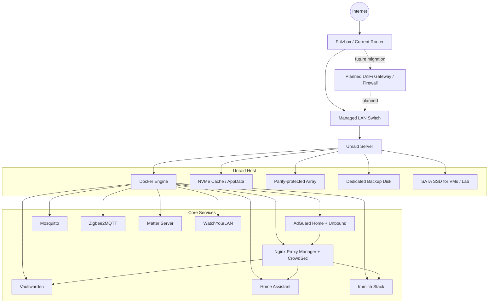
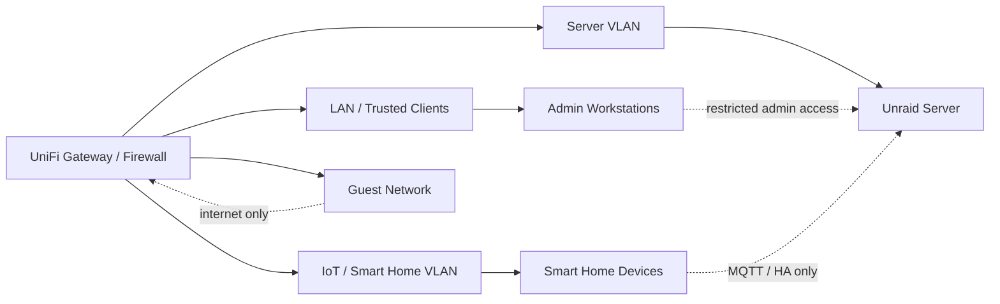

# Unraid Homelab Infrastructure

> Self-hosted infrastructure project focused on storage design, containerized services, internal DNS/HTTPS, backup automation and a security-oriented network roadmap.

## Overview

This repository documents the design and operation of my Unraid-based homelab. The goal is not only to host useful services, but to build and maintain the environment with a sysadmin/security mindset: clear storage separation, controlled access, automated backups, internal DNS, reverse proxying, and a roadmap toward proper network segmentation.

The setup is used as a practical learning and operations platform for topics such as:

* Linux server administration
* Docker/container operations
* Storage and backup design
* Internal DNS and service discovery
* Reverse proxy and TLS concepts
* Smart home infrastructure
* Monitoring and network visibility
* Future firewalling and VLAN segmentation

---

## Goals

* Build a compact, maintainable and power-conscious self-hosting platform
* Run core services in containers with persistent AppData separation
* Use Unraid parity protection for important array data
* Keep application data and bulk data separated by storage role
* Automate local backups for important datasets
* Prepare an offsite backup strategy following the 3-2-1 principle
* Move toward a more security-focused network design with UniFi firewalling and VLANs

---

## Hardware

| Component        | Model / Description      |
| ---------------- | ------------------------ |
| Case             | Jonsbo N6                |
| Mainboard        | Gigabyte B760M DS3H DDR4 |
| CPU              | Intel Core i5-12500T     |
| Memory           | 32 GiB DDR4              |
| PSU              | NZXT Core Gold 750 W     |
| Operating System | Unraid                   |

### Storage Layout

| Device   |                     Model |               Capacity | Purpose                                                          |
| -------- | ------------------------: | ---------------------: | ---------------------------------------------------------------- |
| NVMe SSD |              WD Red SN700 |                 500 GB | AppData, Docker data, cache                                      |
| HDD      |              WDC WD80EFPX |                   8 TB | Main data disk / productive data                                 |
| HDD      |       Planned parity disk |         8 TB or larger | Unraid parity protection and future storage expansion            |
| HDD      |              WDC WD40EFRX |                   4 TB | Local backup target                                              |
| HDD      |         Private data disk |           4 TB planned | Private/important data, parity protected once added              |
| HDD      |      Additional data disk | 8 TB or larger planned | Future expansion if the current 8 TB data disk is not sufficient |
| SATA SSD | Micron 1100 MTFDDAK256TBN |                 256 GB | VMs, tests and experiments                                       |

The storage layout is designed around clear roles:

* **NVMe SSD:** fast storage for Docker AppData and cache workloads
* **Array disks:** persistent data protected by Unraid parity
* **Backup disk:** dedicated local backup target with restricted share access
* **SATA SSD:** isolated space for virtual machines and lab experiments

---

## Service Stack

The environment uses Docker containers and Docker Compose stacks for service isolation and maintainability.

| Area                     | Service(s)                     | Purpose                                                   |
| ------------------------ | ------------------------------ | --------------------------------------------------------- |
| DNS / Filtering          | AdGuard Home + Unbound         | Local DNS resolution, filtering and upstream DNS handling |
| Reverse Proxy / Security | Nginx Proxy Manager + CrowdSec | Internal HTTPS routing and security hardening             |
| Password Management      | Vaultwarden                    | Self-hosted password vault                                |
| Smart Home               | Home Assistant                 | Central automation platform                               |
| Smart Home Messaging     | Mosquitto                      | MQTT broker                                               |
| Zigbee                   | Zigbee2MQTT                    | Zigbee device integration via MQTT                        |
| Matter                   | Matter Server                  | Matter integration for Home Assistant                     |
| Photos                   | Immich Stack                   | Self-hosted photo management                              |
| Database                 | PostgreSQL / Redis             | Backend services for selected applications                |
| Network Visibility       | WatchYourLAN                   | LAN device discovery and visibility                       |
| Knowledge / Docs         | Kiwix, Joplin Server           | Optional documentation and offline knowledge services     |

> Media transcoding and personal video processing services are intentionally not part of this portfolio documentation, as the focus is on infrastructure, administration and security-relevant design decisions.

---

## Architecture



---

## Backup Strategy

The backup concept is built around separating application state, active user data and mostly static data.

| Backup Type    |     Schedule | Scope                                   | Purpose                                               |
| -------------- | -----------: | --------------------------------------- | ----------------------------------------------------- |
| AppData Backup |      Regular | Docker AppData and service state        | Restore container configurations and application data |
| Weekly Backup  |  `0 5 * * 1` | Photos and selected important data      | Protect frequently changing important data            |
| Monthly Backup | `30 5 1 * *` | Mostly static archive / data collection | Efficient backup of rarely changing data              |
| Offsite Backup |      Planned | Critical data                           | Complete the 3-2-1 backup strategy                    |

### Backup Design Notes

* The backup share is intentionally restricted to the required data disk.
* Backup targets are separated from the primary AppData/cache workload.
* Backup frequency is based on data change rate.
* Offsite backup is planned to reduce risk from theft, fire, ransomware or full-system loss.
* Future improvement: documented restore tests for selected services.

### 3-2-1 Backup Roadmap

Current state:

* Primary data on Unraid array
* Local backup disk for selected shares
* Automated weekly and monthly backup jobs
* AppData backup for container state

Planned state:

* Add offsite backup for critical datasets
* Document restore procedure
* Periodically test sample restores
* Add backup monitoring and alerting

---

## Security Concept

Security decisions are documented as part of the system design rather than added as an afterthought.

### Current Security Measures

* Internal DNS through AdGuard Home + Unbound
* Reverse proxy layer through Nginx Proxy Manager
* CrowdSec integration for additional protection and visibility
* VPN-first remote access approach is already implemented
* No unnecessary public exposure of internal services
* Service separation through containers and dedicated AppData paths
* Dedicated backup share with limited disk access
* Password management through Vaultwarden
* Controlled local service access via internal hostnames

### Planned Security Improvements

* UniFi Cloud Gateway Fibre deployment as dedicated gateway/firewall
* U7 Lite access point for managed Wi-Fi
* VLAN segmentation for clients, servers and IoT devices
* Dedicated firewall rules between network zones
* Expand and document VPN access concept as part of the future UniFi firewall design
* Better monitoring and alerting
* More formal documentation of update and restore procedures

---

## Planned Network Segmentation

The future network design is intended to reduce lateral movement and separate device classes. The planned network stack is based on a UniFi Cloud Gateway Fibre and a U7 Lite access point.



Planned policy direction:

| Zone        | Access Direction                            | Notes                                                                        |
| ----------- | ------------------------------------------- | ---------------------------------------------------------------------------- |
| Trusted LAN | May access selected internal services       | Admin clients and normal workstations                                        |
| Server VLAN | Hosts self-hosted services                  | Limited inbound access through defined rules                                 |
| IoT VLAN    | Only required access to Home Assistant/MQTT | Reduce trust in smart devices                                                |
| Guest VLAN  | Internet-only                               | No access to internal services                                               |
| VPN         | Remote admin/user access                    | Already implemented as the preferred access method over public port exposure |

---

## Operations

### Maintenance Approach

* Keep container data persistent and separated from container images
* Use AppData backup before major changes
* Update services deliberately instead of blindly auto-updating everything
* Keep configuration changes documented
* Prefer reversible changes for network and storage modifications

### Restore Priorities

1. Unraid boot/configuration
2. AppData and Docker service state
3. DNS / reverse proxy / password manager
4. Home Assistant and MQTT stack
5. Photos and private data
6. Lab/experimental VMs

---

## Roadmap

| Status      | Item                                                    |
| ----------- | ------------------------------------------------------- |
| In progress | Complete parity-protected storage layout                |
| Planned     | Add private data disk after parity is active            |
| Planned     | Implement UniFi Cloud Gateway Fibre as gateway/firewall |
| Planned     | Add U7 Lite access point for managed Wi-Fi              |
| Planned     | Design VLANs and firewall rules                         |
| Planned     | Add offsite backup target                               |
| Planned     | Document restore tests                                  |
| Planned     | Add sanitized screenshots and diagrams                  |
| Planned     | Add example backup scripts without secrets              |

---

## Repository Structure

```text
homelab-unraid/
├── README.md
├── docs/
│   ├── architecture.md
│   ├── backup-strategy.md
│   ├── security-concept.md
│   ├── storage-layout.md
│   └── network-roadmap.md
├── diagrams/
│   ├── architecture.mmd
│   └── network-segmentation.mmd
├── scripts/
│   └── backup-example.sh
└── screenshots/
    └── sanitized/
```

---

## Notes

This repository is intended as a technical portfolio project. It focuses on the planning, operation and security considerations of a real self-hosted environment rather than only listing hosted applications.

Sensitive information such as public IP addresses, internal secrets, tokens, serial numbers and private file paths must be removed before publishing screenshots or configuration examples.
