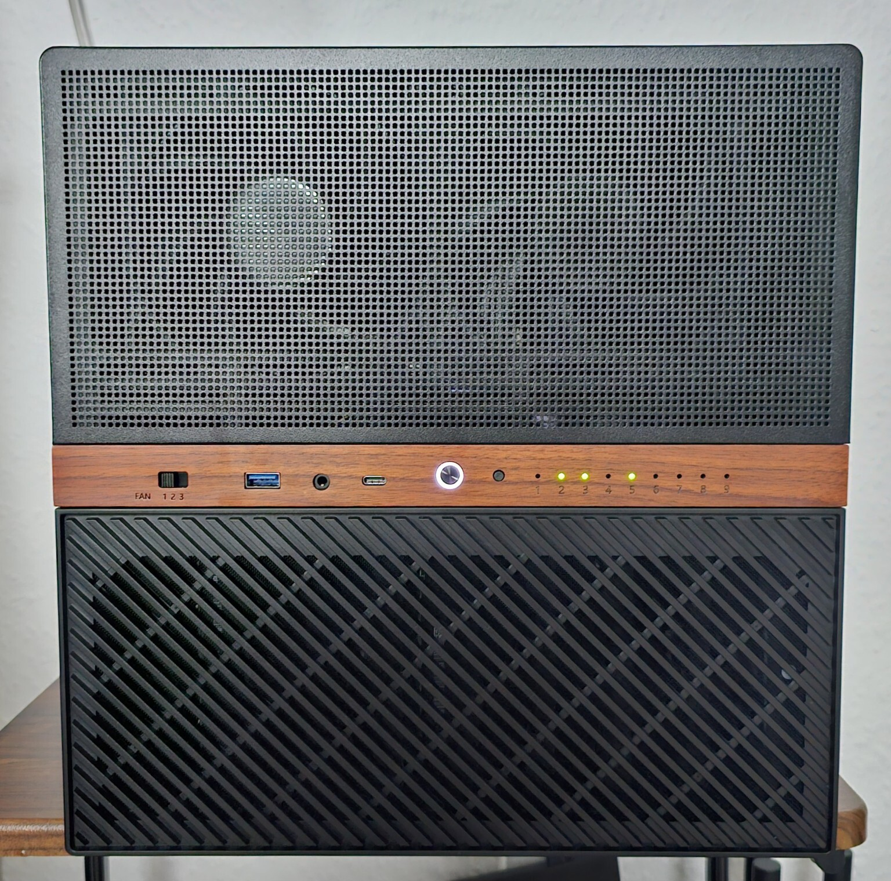
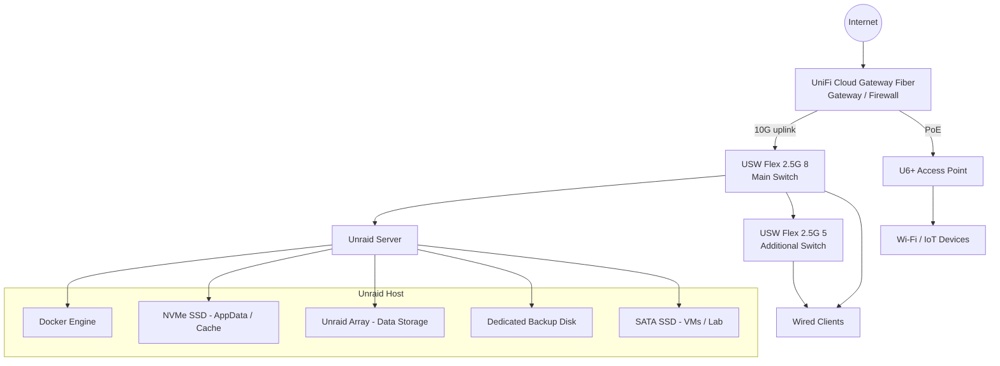

# Unraid Homelab Infrastructure

## Kurzbeschreibung

Dieses Repository dokumentiert mein privates Unraid-basiertes Homelab.

Der Fokus liegt auf Storage-Design, Docker-Services, Backup-Strategie, internem DNS, Reverse Proxying, VPN-first Zugriff sowie einer umgesetzten UniFi-basierten VLAN- und Firewall-Segmentierung.

Das Projekt dient als praxisnahe Lern- und Dokumentationsumgebung für Systemadministration, Self-Hosting, Netzwerksicherheit, Backup-/Restore-Planung und den Betrieb eigener Infrastruktur.

---

This repository documents my Unraid-based homelab.

The setup is used as a practical learning environment for system administration, self-hosting, backups, internal DNS, reverse proxying, VPN-first remote access and network segmentation.
It is not meant to look like a finished enterprise environment. It is a real homelab that I use, maintain and improve over time.

The main focus areas are:

- Unraid storage design
- Docker-based services
- AppData and share backups
- VPN-first remote access
- Internal DNS and reverse proxying
- Smart home infrastructure
- UniFi-based firewall and VLAN segmentation

---

## Current Status

| Area | Status |
|---|---|
| Unraid server | Running |
| Docker services | Running |
| Internal DNS | Implemented with AdGuard Home and Unbound |
| Internal reverse proxy | Implemented with Nginx Proxy Manager |
| VPN-first remote access | Implemented |
| Local backups | Implemented for AppData and selected shares |
| Array parity | Implemented with an 8 TB parity disk |
| Private data disk | Implemented with a dedicated 4 TB disk |
| UniFi gateway/firewall | Implemented |
| VLAN segmentation | Implemented |
| Firewall rules | Implemented between network zones |
| Offsite backup | Planned |

---

## Hardware

| Component | Model / Description |
|---|---|
| Case | Jonsbo N6 |
| Mainboard | Gigabyte B760M DS3H DDR4 |
| CPU | Intel Core i5-12500T |
| Memory | 32 GiB DDR4 |
| PSU | NZXT Core Gold 750 W |
| SATA Expansion | M.2 PCIe SATA expansion adapter for additional SATA ports |
| Operating System | Unraid |

---

## Hardware Build

The system is built in a compact Jonsbo N6 case with up to nine drive bays. It is used as my Unraid-based homelab for storage, Docker services, backups and lab workloads.

## Storage Overview

The storage layout is built around clear roles. Application data, user data, backups and lab workloads should not all live in the same place.

| Device | Model | Capacity | Purpose |
|---|---:|---:|---|
| NVMe SSD | WD Red SN700 | 500 GB | AppData, Docker data and cache |
| HDD | WDC WD80EFPX | 8 TB | Main data disk |
| HDD | Parity disk | 8 TB | Unraid parity protection |
| HDD | WDC WD40EFRX | 4 TB | Local backup target |
| HDD | Private data disk | 4 TB | Private and important data |
| SATA SSD | Micron 1100 MTFDDAK256TBN | 256 GB | Virtual machines, testing and experiments |

Important design notes:

- The NVMe SSD is used for Docker AppData and cache workloads.
- The Unraid array is used for long-term data storage.
- Active parity protects the array against a single data disk failure.
- Parity is not treated as a replacement for backups.
- A dedicated 4 TB HDD is used as the local backup target.
- A separate 4 TB HDD is used for private and important data.
- A separate SATA SSD is used for VMs and lab/testing workloads.
- Additional SATA connectivity is provided through an M.2 PCIe SATA expansion adapter.

More details: [Storage Layout](docs/storage-layout.md)

---

## Service Stack

The services are grouped by their role in the environment. Not every private, temporary or experimental container is documented here.

| Area | Services | Purpose |
|---|---|---|
| DNS and filtering | AdGuard Home, Unbound | Internal DNS, filtering and name resolution |
| Reverse proxy and security | Nginx Proxy Manager, CrowdSec | Internal HTTPS routing and additional visibility |
| Password management | Vaultwarden | Self-hosted password management |
| Smart home | Home Assistant, Mosquitto, Zigbee2MQTT, Matter Server | Smart home automation and device integration |
| Photo management | Immich stack | Self-hosted photo management |
| Network visibility | WatchYourLAN | Basic LAN device visibility |
| Knowledge and documentation | Kiwix, Joplin | Notes and offline/local knowledge resources |
| Backend services | PostgreSQL, Redis | Databases and supporting services |

The goal is not just to run many applications, but to understand their roles, dependencies, access paths and backup requirements.

More details: [Service Overview](docs/service-overview.md)

---

## Architecture

The current setup uses Unraid as the central storage and container host. Network access is handled through a UniFi-based setup with VLAN segmentation and firewall rules.

More details: [Architecture](docs/architecture.md)

---

## Backup Strategy

The backup setup is based on how often the data changes and how important it is for restoring the system.

| Backup Type | Schedule | Scope | Purpose |
|---|---:|---|---|
| AppData Backup | Scheduled | Docker AppData and service state | Restore container configurations and application data |
| Weekly Backup | `0 5 * * 1` | Photos and selected important data | Protect data that changes more often |
| Monthly Backup | `30 5 1 * *` | Mostly static archive data | Back up data that rarely changes |
| Offsite Backup | Planned | Critical data | Complete the 3-2-1 backup strategy |

The local backup disk is useful for quick restores, but it is not the final backup concept. An offsite backup target is still planned for important data.

Unraid parity and backups are treated as separate things:

- Parity helps with disk availability and protects against a single data disk failure.
- Backups protect against deletion, broken updates, corruption, misconfiguration and complete system loss.

More details: [Backup Strategy](docs/backup-strategy.md)

---

## Security Approach

The current security approach is based on keeping services private by default, using VPN for remote access and separating devices through VLANs and firewall rules.

Current measures:

- VPN-first remote access is implemented.
- Internal services are not exposed publicly by default.
- Internal DNS is handled through AdGuard Home and Unbound.
- Nginx Proxy Manager is used as an internal reverse proxy.
- CrowdSec is used as an additional security and visibility component.
- UniFi gateway/firewall is implemented.
- VLAN segmentation is implemented for different device groups.
- Firewall rules are used to restrict traffic between network zones.
- Sensitive services such as Vaultwarden are treated as higher-priority services for backups and access control.
- Backup targets are separated from normal productive storage.

Remaining improvements:

- Offsite backup for important data
- Better restore documentation and restore testing
- Monitoring/notifications for failed backup jobs
- Ongoing cleanup and documentation of network exceptions

More details: [Security Concept](docs/security-concept.md)

---

## Network Segmentation

The network has been migrated from a mostly flat home network to a UniFi-based setup with VLAN segmentation and firewall rules.

Current network components:

| Component | Role |
|---|---|
| UniFi Cloud Gateway Fiber | Gateway, firewall and network controller |
| U6+ | Managed Wi-Fi access point, connected directly to the gateway via PoE |
| USW Flex 2.5G 8 | Main 2.5G switch, connected to the gateway with a 10G uplink |
| USW Flex 2.5G 5 | Additional 2.5G switch for wired clients |
| Unraid server | Server and infrastructure services |

The main switch is connected to the UniFi Cloud Gateway Fiber through a 10G uplink. 
The U6+ access point is connected directly to the gateway via PoE, while the Unraid server and other wired devices are connected through the 2.5G switch infrastructure.

Current network zones:

| Zone | Purpose |
|---|---|
| Default / Native | Kept minimal for compatibility and transition purposes |
| Management | Network and admin devices |
| Trusted | Main trusted clients and daily-use devices |
| Untrusted | Less trusted client devices with restricted internal access |
| Server | Unraid and infrastructure services |
| Media | Media and TV devices |
| IoT | Smart home and IoT devices |
| Guest | Guest devices with internet-only access |
| Lab | Testing and lab devices |
| Print | Printer devices |
| VPN | Remote access to selected internal services |

The VLANs are separated through firewall rules. The goal is to allow only required traffic between zones and reduce unnecessary lateral movement inside the network.
Exact VLAN IDs, IP ranges, internal hostnames and detailed firewall rule names are intentionally not published in this repository.

More details: [Network Roadmap](docs/network-roadmap.md)

---

## Documentation

The repository is split into several documentation files:

| Document | Description |
|---|---|
| [Architecture](docs/architecture.md) | Current Unraid architecture, access model and UniFi network design |
| [Storage Layout](docs/storage-layout.md) | Storage roles, AppData/cache design, array layout and current disk layout |
| [Backup Strategy](docs/backup-strategy.md) | AppData backup, weekly/monthly backups and 3-2-1 backup roadmap |
| [Security Concept](docs/security-concept.md) | VPN-first access, internal DNS, reverse proxying and VLAN segmentation |
| [Network Roadmap](docs/network-roadmap.md) | UniFi network design, VLANs and firewall direction |
| [Service Overview](docs/service-overview.md) | Overview of the main infrastructure and application services |

---

## Roadmap

| Status | Item |
|---|---|
| Done | Add 8 TB parity disk |
| Done | Add dedicated 4 TB private data disk |
| Done | Implement UniFi gateway/firewall |
| Done | Create VLAN segmentation |
| Done | Add firewall rules between network zones |
| Done | Document core network zones and access concept |
| In progress | Keep storage, backup and network documentation up to date |
| Planned | Add offsite backup target |
| Planned | Document restore tests |
| Planned | Add monitoring/notifications for failed backup jobs |
| Planned | Add more sanitized screenshots and example configurations |

---

## Notes

This repository is intended as a technical portfolio and documentation project.

It focuses on how the environment is planned, operated and improved over time. Private workloads, secrets and sensitive configuration details are intentionally not included.
