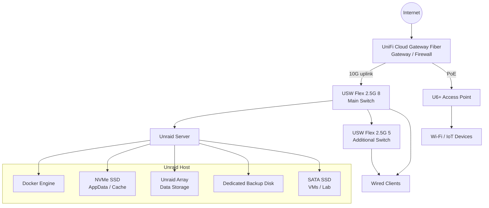
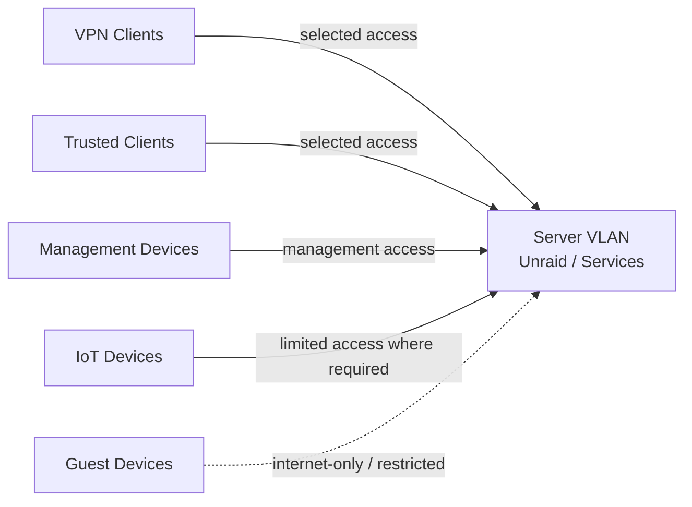

# Architecture

This document describes the current architecture of my Unraid-based homelab.

The system is built around Unraid as the central storage and container platform. It runs infrastructure services, selected self-hosted applications and smart home components. The network is based on UniFi hardware with VLAN segmentation and firewall rules.

---

## Goals

The main goals of this architecture are:

- Keep the environment understandable and maintainable
- Separate storage, application data, backups and lab workloads
- Keep services private by default
- Use VPN-first remote access instead of exposing services directly
- Use internal DNS and reverse proxying for clean access to services
- Segment the network into different trust zones
- Document decisions, limitations and future improvements

---

## High-Level Architecture

---

## Main Components

| Component | Role |
|---|---|
| Unraid server | Central storage, Docker and lab host |
| UniFi Cloud Gateway Fiber | Gateway, firewall and network controller |
| USW Flex 2.5G 8 | Main 2.5G switch, connected to the gateway with a 10G uplink |
| USW Flex 2.5G 5 | Additional 2.5G switch for wired clients |
| U6+ | Managed Wi-Fi access point, connected directly to the gateway via PoE |
| AdGuard Home / Unbound | Internal DNS, filtering and upstream DNS resolution |
| Nginx Proxy Manager | Internal reverse proxy and HTTPS access |
| CrowdSec | Additional security and visibility component |
| Docker | Container platform for infrastructure and application services |
| Unraid array | Long-term data storage with parity protection |
| NVMe cache | AppData, Docker data and cache workloads |
| Dedicated backup disk | Local backup target |
| SATA SSD | Virtual machines, testing and lab workloads |

---

## Access Model

The access model is based on keeping services private by default.

Remote access is handled through VPN. Internal services are not exposed directly to the public internet by default. Internal DNS and reverse proxying are used to make services easier to access inside the network.

The general access model is:

---

## Network Zones

The network is segmented into different VLANs. The goal is to reduce unnecessary trust between devices and only allow required traffic between zones.

| Zone | Purpose |
|---|---|
| Default / Native | Kept minimal for compatibility and transition purposes |
| Management | Network and admin devices |
| Trusted | Main trusted clients and daily-use devices |
| Untrusted | Less trusted client devices with restricted internal access |
| Server | Unraid and infrastructure services |
| Media | Media and TV devices |
| IoT | Smart home and IoT devices |
| Guest | Guest devices with internet-only access |
| Lab | Testing and lab devices |
| Print | Printer devices |
| VPN | Remote access to selected internal services |

Exact IP ranges, internal hostnames and detailed firewall rule names are intentionally not published in this repository.

---

## Docker and Service Architecture

Docker services are hosted on Unraid. Services are grouped by role and documented separately.

Main service groups:

- DNS and filtering
- Reverse proxy and security
- Password management
- Smart home infrastructure
- Photo management
- Network visibility
- Knowledge and documentation
- Backend services

The goal is not only to run services, but to understand their dependencies, access paths and backup requirements.

More details: [Service Overview](service-overview.md)

---

## Storage Architecture

The storage layout separates different workload types:

| Storage Area | Purpose |
|---|---|
| NVMe SSD | Docker AppData, cache and frequently changing application data |
| Unraid array | Main long-term data storage |
| Parity disk | Protection against a single data disk failure |
| Dedicated backup disk | Local backup target for selected data |
| Private data disk | Private and important data |
| SATA SSD | Virtual machines, tests and lab workloads |

Parity is active, but it is not treated as a backup. Backups are handled separately.

More details: [Storage Layout](storage-layout.md)

---

## Backup Architecture

The backup concept separates AppData backups from share-level backups.

Current backup layers:

- AppData backup for container and service recovery
- Weekly backups for photos and selected important data
- Monthly backups for mostly static archive data
- Dedicated local backup disk
- Planned offsite backup for important data

More details: [Backup Strategy](backup-strategy.md)

---

## Security Architecture

The current security approach is based on several layers:

- VPN-first remote access
- No public exposure of internal services by default
- Internal DNS through AdGuard Home and Unbound
- Internal reverse proxying through Nginx Proxy Manager
- CrowdSec as an additional security and visibility component
- VLAN segmentation
- Firewall rules between network zones
- Separated backup target
- Sanitized public documentation

More details: [Security Concept](security-concept.md)

---

## Current Limitations

The environment is operational, but not finished.

Current limitations and improvement areas:

- Offsite backup is still planned
- Restore tests should be documented better
- Monitoring and notifications for failed backup jobs should be improved
- Firewall exceptions should be reviewed and documented over time
- More sanitized screenshots and example configurations can be added later

---

## Summary

This architecture is designed to be practical, understandable and maintainable.

It is a real homelab environment that combines storage, Docker services, backups, VPN-first access, internal DNS, reverse proxying and UniFi-based network segmentation.
