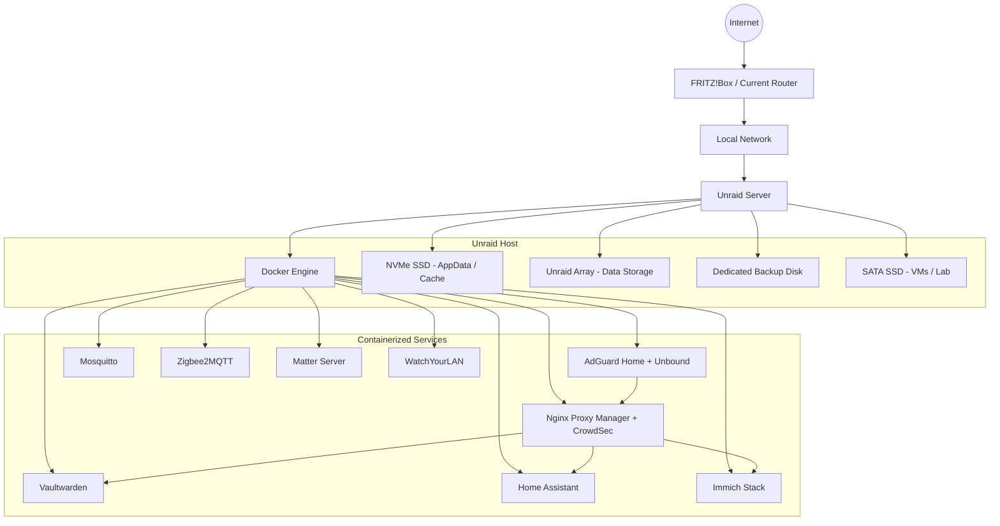
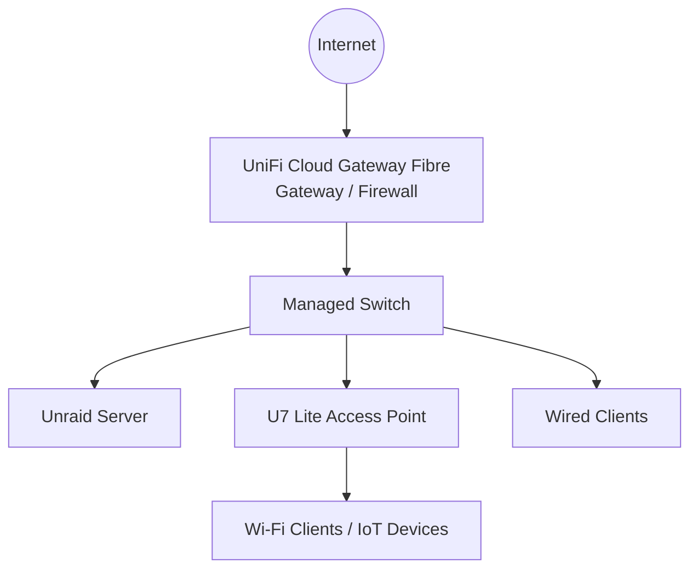
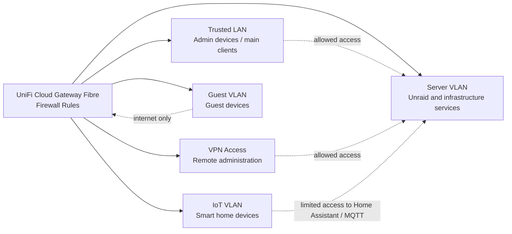

# Architecture

This document gives an overview of my current Unraid homelab architecture and the direction I want to take it in.

The setup is used as a practical learning environment for system administration, self-hosting, backups, internal DNS, reverse proxying and security-focused network design. It is not meant to be a finished enterprise setup, but a continuously improved homelab with real services and real operational requirements.

## High-Level Overview

The homelab is built around one Unraid server. It provides storage, runs my Docker-based services and also gives me a place to test new tools and concepts.

Main responsibilities of the system:

- Storage management with Unraid
- Docker-based service hosting
- Internal DNS and service discovery
- Internal HTTPS access through a reverse proxy
- Smart home infrastructure
- Local backup targets
- VPN-first remote access
- Future firewall and VLAN-based network segmentation

## Current Architecture

## Component Roles

| Component | Role |
|---|---|
| FRITZ!Box | Current router and internet gateway |
| Unraid Server | Central storage and container host |
| Docker | Runs the self-hosted services |
| NVMe SSD | AppData, Docker data and cache workloads |
| Unraid Array | Main storage for persistent data |
| Backup Disk | Local backup target for selected shares and AppData backups |
| SATA SSD | Virtual machines, testing and experiments |
| AdGuard Home + Unbound | Internal DNS, filtering and DNS resolution |
| Nginx Proxy Manager + CrowdSec | Internal reverse proxy and additional security layer |
| Vaultwarden | Self-hosted password management |
| Home Assistant Stack | Smart home automation and device integration |
| Immich Stack | Self-hosted photo management |
| WatchYourLAN | LAN device visibility and basic network inventory |

## Service Access Model

The environment currently follows a VPN-first approach.

Internal services are mainly accessed from inside the local network or through VPN. I try to avoid exposing services directly to the public internet unless there is a clear reason and proper protection in place.

| Access Type | Status | Notes |
|---|---|---|
| Local LAN access | Implemented | Used for normal internal access |
| VPN access | Implemented | Preferred method for remote access |
| Public port exposure | Avoided | Services are not exposed publicly by default |
| Reverse proxy | Implemented internally | Used for clean internal HTTPS and service routing |
| UniFi firewalling | Planned | Future gateway, firewall and VLAN design |

## Internal DNS and HTTPS

Internal DNS is handled by AdGuard Home and Unbound. This allows me to access services through readable internal hostnames instead of remembering IP addresses and ports.

Nginx Proxy Manager is used as the reverse proxy layer. It provides a cleaner access structure for internal services and helps centralize HTTPS routing.

Benefits of this approach:

- Services can be reached through readable hostnames
- Reverse proxy configuration is managed in one place
- Fewer direct port-based access URLs are needed
- Internal services are easier to organize
- The setup is prepared for future access-control improvements

## Container Architecture

Most services are running as Docker containers. This makes the setup easier to maintain, move and back up.

My main container design principles:

- Persistent data is stored outside the container itself
- AppData is separated from container images
- Databases are kept persistent
- Important service state can be restored from AppData backups
- Test services and lab workloads should be separated from critical services where possible

## Backup-Relevant Architecture

The storage layout separates active application data, productive data and backup targets.

Backup-relevant design choices:

- AppData is stored on the NVMe SSD
- AppData is backed up separately because it contains service configuration and application state
- Important shares are backed up through scheduled backup jobs
- The backup share is restricted to the required disk
- Offsite backup is planned to complete the 3-2-1 strategy
- Array parity is planned with an 8 TB or larger parity disk

The current backup approach already covers local backups. The next major improvement is an offsite backup target for important data.

## Planned UniFi Architecture

A future network upgrade is planned with a UniFi Cloud Gateway Fibre and a U7 Lite access point.

The UniFi Cloud Gateway Fibre will act as the central gateway and firewall. A managed switch will connect wired devices such as the Unraid server, while the U7 Lite access point will provide managed Wi-Fi.

## Planned VLAN Design

The planned VLAN design separates trusted clients, server workloads, IoT devices and guest access.

This is the security direction I want to move toward once the UniFi gateway and access point are in place.

## Planned Segmentation Goals

| Zone | Purpose | Access Concept |
|---|---|---|
| Trusted LAN | Main clients and admin devices | Access to selected internal services |
| Server VLAN | Server and infrastructure services | Restricted inbound access |
| IoT VLAN | Smart home and IoT devices | Only required access to Home Assistant/MQTT |
| Guest VLAN | Guest devices | Internet-only access |
| VPN | Remote access | Preferred access path for administration and services |

## Design Summary

The main idea behind this architecture is to keep the setup understandable, maintainable and secure enough for a real homelab environment.

Important design points:

- Important data should be separated and backed up
- Services should not be exposed publicly by default
- VPN is the preferred remote access method
- Internal DNS and reverse proxying make services easier to access
- Container data should be restorable through AppData backups
- The network should later be segmented with VLANs and firewall rules
