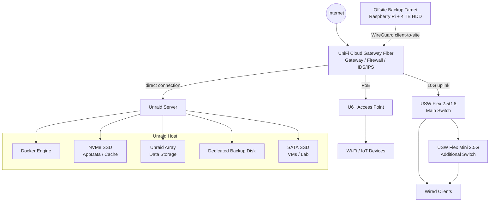

# Architecture

This document describes the current architecture of my Unraid-based homelab.

Unraid is the central storage and container host. Around it I run internal infrastructure services, selected self-hosted applications, smart home components and a segmented UniFi network.

I try to keep the setup practical: simple enough to maintain, but structured enough that storage, backups, services and network access do not all depend on one flat design.

---

## What this setup should solve

I do not want this homelab to be just a random collection of containers and disks. The architecture should make it clear which parts of the setup are responsible for storage, services, backups, network access and lab workloads.

The main goals are:

- keep the setup understandable when I look at it again later
- separate application data, user data, backups and lab workloads
- avoid exposing internal services directly to the internet
- use VPN, internal DNS and reverse proxying in a controlled way
- separate clients, servers, IoT, guest, work, gaming, print and lab devices
- make backups and restore planning part of the design
- keep a copy of important data outside my home
- keep enough room for future changes without rebuilding everything

---

## High-Level Architecture

```mermaid
flowchart TD
    Internet((Internet))
    UCG["UniFi Cloud Gateway Fiber<br/>Gateway / Firewall / IDS/IPS"]
    Flex8["USW Flex 2.5G 8<br/>Main Switch"]
    FlexMini["USW Flex Mini 2.5G<br/>Additional Switch"]
    AP["U6+ Access Point"]
    Unraid["Unraid Server"]
    WiredClients["Wired Clients"]
    WiFiClients["Wi-Fi / IoT Devices"]
    Offsite["Offsite Backup Target<br/>Raspberry Pi + 4 TB HDD"]

    Internet --> UCG
    UCG -->|"direct connection"| Unraid
    UCG -->|"10G uplink"| Flex8
    UCG -->|"PoE"| AP
    Flex8 --> FlexMini
    Flex8 --> WiredClients
    FlexMini --> WiredClients
    AP --> WiFiClients
    Offsite -.->|"WireGuard client-to-site"| UCG

    subgraph UnraidHost["Unraid Host"]
        Docker["Docker Engine"]
        Cache["NVMe SSD<br/>AppData / Cache"]
        ArrayStorage["Unraid Array<br/>Data Storage"]
        BackupDisk["Dedicated Backup Disk"]
        LabSSD["SATA SSD<br/>VMs / Lab"]
    end

    Unraid --> Docker
    Unraid --> Cache
    Unraid --> ArrayStorage
    Unraid --> BackupDisk
    Unraid --> LabSSD
```

---

## Main Components

| Component | Role |
|---|---|
| Unraid server | Central storage, Docker and lab host |
| UniFi Cloud Gateway Fiber | Gateway, firewall, IDS/IPS, VPN and network controller |
| USW Flex 2.5G 8 | Main 2.5G switch, connected to the gateway with a 10G uplink |
| USW Flex Mini 2.5G | Additional 2.5G switch for wired clients |
| U6+ | Managed Wi-Fi access point, connected directly to the gateway via PoE |
| AdGuard Home / Unbound | Internal DNS, filtering and upstream DNS resolution |
| Nginx Proxy Manager | Internal reverse proxy and HTTPS access |
| CrowdSec | Additional security and visibility component |
| Docker | Container platform for infrastructure and application services |
| Unraid array | Long-term data storage with parity protection |
| NVMe SSD | AppData, Docker data and cache workloads |
| Dedicated backup disk | Local backup target |
| SATA SSD | Virtual machines, testing and lab workloads |
| Offsite backup target | Raspberry Pi with a 4 TB HDD at an offsite location, append-only restic target |
| Uptime Kuma | Monitoring for the offsite backup job |

---

## Design Notes

A few decisions shape the current setup:

- The Unraid server is connected directly to the gateway.
- The main switch uses a 10G uplink to the gateway.
- The access point is connected directly to the gateway via PoE.
- Internal services are private by default.
- Remote access is handled through VPN.
- Internal DNS and reverse proxying make service access cleaner.
- Network zones separate clients, servers, IoT devices, guests, work devices, gaming devices, printers and lab workloads.
- Parity is active, but backups are handled separately.
- The offsite backup is append-only, so the server can add snapshots but not delete them.

---

## Access Model

The access model is based on VPN-first remote access and controlled internal access.

| Source | Access idea |
|---|---|
| Management devices | Access to management interfaces and administrative services |
| Trusted clients | Access to selected internal services |
| VPN clients | Remote access to selected internal services |
| IoT devices | Limited access where smart home communication requires it |
| Guest devices | Internet-only access |
| Work devices | Internet-only access, isolated from all internal networks |
| Gaming devices | Internet-only access, isolated from all internal networks |
| Lab devices | Restricted testing access, separated from normal production services |
| Offsite backup target | Only reachable from the Unraid server, cannot open connections into my internal networks |

Internal services are not exposed publicly by default. If a service needs to be reachable, I prefer to document the access path instead of adding temporary exceptions and forgetting about them later.

---

## Network Zones

The network is segmented into different zones. The exact implementation is documented in more detail in the network documentation.

| Zone | Purpose |
|---|---|
| Default / Native | Compatibility and transition network |
| Management | Network and admin devices |
| Trusted | Main trusted clients and daily-use devices |
| Untrusted | Less trusted client devices with restricted internal access |
| Server | Unraid and infrastructure services |
| Media | Media and TV devices |
| IoT | Smart home and IoT devices |
| Guest | Guest devices in UniFi's Hotspot zone with internet-only access |
| Work | Work devices with their own company VPN |
| Gaming | Consoles and gaming PCs with unfiltered DNS |
| Lab | Testing and lab devices |
| Print | Printer devices |
| VPN | Remote access to selected internal services and the offsite backup tunnel |

More details: [Network Segmentation](network-roadmap.md)

---

## Docker and Service Layout

Docker services run on Unraid. I group them by role instead of treating them as one big list of containers.

Main service groups:

- DNS and filtering
- Reverse proxy and security
- Password management
- Smart home infrastructure
- Photo management
- Network visibility and monitoring
- Documentation and knowledge services
- Backend services such as PostgreSQL and Redis

For me, the important part is understanding what each service depends on: persistent data, DNS, reverse proxy access, databases and backups.

More details: [Service Overview](service-overview.md)

---

## Storage Layout

The storage layout separates different workload types.

| Storage Area | Purpose |
|---|---|
| NVMe SSD | Docker AppData, cache and frequently changing application data |
| Unraid array | Main long-term data storage |
| Parity disk | Protection against a single data disk failure |
| Dedicated backup disk | Local backup target for selected data |
| Private data disk | Private and important data |
| SATA SSD | Virtual machines, tests and lab workloads |
| Offsite backup disk | Offsite copy of important data |

Parity protects against a single data disk failure, but it is not a backup. Backups are planned and documented separately.

More details: [Storage Layout](storage-layout.md)

---

## Backup Layout

The backup concept is split into AppData backups, share-level backups and an offsite backup.

Current backup layers:

- AppData backup for container and service recovery
- Weekly backups for photos and selected important data
- Monthly backups for mostly static archive data
- Dedicated local backup disk
- Weekly offsite backup with restic over a WireGuard tunnel
- Monitoring and notifications for the offsite backup job

More details: [Backup Strategy](backup-strategy.md)

---

## Security-Relevant Parts

Security is handled through multiple small layers instead of relying on one single feature.

Current measures include:

- VPN-first remote access
- no public exposure of internal services by default
- internal DNS through AdGuard Home and Unbound
- internal reverse proxying through Nginx Proxy Manager
- CrowdSec around the proxy stack
- IDS/IPS on the UniFi gateway
- VLAN-based network segmentation
- firewall rules between network zones
- separate backup target
- append-only offsite backup
- sanitized public documentation

More details: [Security Concept](security-concept.md)

---

## Notes

This architecture is still evolving. The current focus is to keep the setup understandable and maintainable while improving restore documentation, monitoring, gateway access rules and network rule documentation over time.
