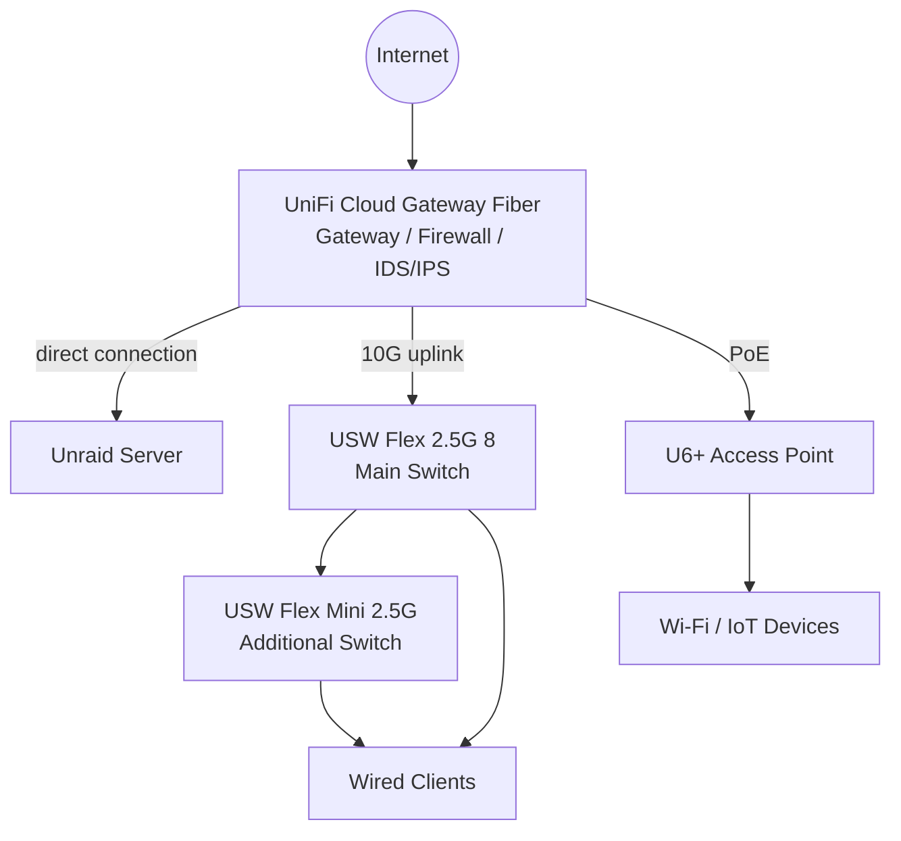
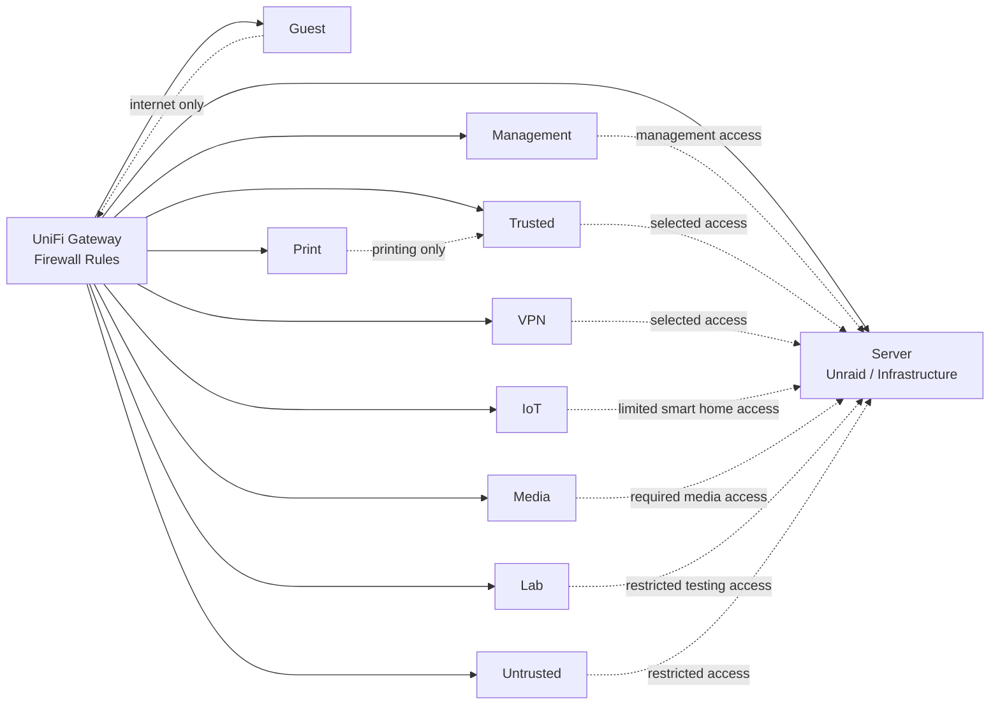

# Network Segmentation

This document describes the current UniFi-based network segmentation of my homelab.

The network has been migrated from a mostly flat home network to a segmented setup with a UniFi gateway/firewall, managed switching, VLAN-based separation and firewall rules.

Exact VLAN IDs, IP ranges, internal hostnames and detailed firewall rule names are intentionally not published in this repository.

---

## Current State

Remote access is handled through VPN, so internal services do not need to be exposed directly to the public internet. Internal DNS and reverse proxying are used for cleaner access to local services.

Current state in short:

- UniFi gateway/firewall implemented
- VLAN segmentation implemented
- Firewall rules between network zones implemented
- IDS/IPS enabled on the UniFi gateway as an additional visibility and protection layer
- Unraid server connected directly to the gateway
- VPN-first remote access
- Internal DNS through AdGuard Home / Unbound
- Internal reverse proxy through Nginx Proxy Manager
- Managed Wi-Fi through a U6+ access point
- 2.5G switching infrastructure with a 10G uplink between gateway and main switch

---

## UniFi Network Setup

The network uses UniFi hardware as the main gateway, firewall and switching layer.

| Component | Role |
|---|---|
| UniFi Cloud Gateway Fiber | Gateway, firewall, IDS/IPS and network controller |
| Unraid server | Server and infrastructure services, connected directly to the gateway |
| USW Flex 2.5G 8 | Main 2.5G switch, connected to the gateway with a 10G uplink |
| USW Flex Mini 2.5G | Additional 2.5G switch for wired clients |
| U6+ | Managed Wi-Fi access point, connected directly to the gateway via PoE |

The Unraid server is connected directly to the UniFi Cloud Gateway Fiber. The main switch is connected to the gateway through a 10G uplink. The U6+ access point is also connected directly to the gateway via PoE, while additional wired clients are connected through the 2.5G switch infrastructure.

---

## Physical Network Layout

---

## Network Zones

The network is segmented into multiple zones to separate trusted devices, servers, IoT devices, guest access and lab workloads.

| Zone | Purpose | Access Concept |
|---|---|---|
| Default / Native | Compatibility and transition network | Kept minimal where possible |
| Management | Network and admin devices | Access to management interfaces |
| Trusted | Main trusted clients and daily-use devices | Access to selected internal services |
| Untrusted | Less trusted client devices | Restricted access to selected services only |
| Server | Unraid and infrastructure services | Access only from allowed networks |
| Media | Media and TV devices | Limited access to required media services |
| IoT | Smart home and IoT devices | Limited access to Home Assistant/MQTT where required |
| Guest | Guest devices | Internet-only access |
| Lab | Testing and lab devices | Separated from production services where possible |
| Print | Printer devices | Only required printing-related access |
| VPN | Remote access | Access to selected internal services |

The goal is not to make the network unnecessarily complex. The goal is to reduce unnecessary trust between devices and make access rules easier to understand and maintain.

---

## Logical Network Layout

---

## Firewall Direction

The firewall rules follow a simple principle:

> Allow only what is needed between networks and block unnecessary lateral movement.

Implemented direction:

- Management devices can access required management interfaces.
- Trusted clients can access selected internal services.
- VPN clients can access selected internal services.
- Server services are not reachable from every network by default.
- IoT devices are restricted to required smart home communication.
- Media devices only receive the access they require.
- Printer access is limited to required printing-related traffic.
- Guest devices are intended for internet-only access.
- Lab devices are separated from normal production services where possible.
- Untrusted devices have restricted access and are not treated like trusted clients.

---

## Gateway Security

The UniFi gateway is used not only for routing and firewall rules, but also as an additional security and visibility layer.

IDS/IPS is enabled on the gateway. I treat it as an additional layer, not as a replacement for proper segmentation, updates, backups or careful service exposure.

The main security idea is:

- keep internal services private by default
- use VPN for remote access
- limit traffic between network zones
- monitor suspicious traffic where possible
- document exceptions instead of letting the network grow uncontrolled

This is still a homelab, so the goal is not to claim an enterprise-grade security setup. The goal is to build a practical, understandable and maintainable network that improves over time.

---

## Operational Notes

The rules are documented at a high level in this public repository. Exact VLAN IDs, IP ranges, internal hostnames and detailed rule names are intentionally not published.

Things I want to keep documented over time:

- Which zones are allowed to access which services
- Which services require exceptions
- Which ports are needed for internal services
- Which rules are temporary and should be cleaned up later
- How the firewall design changes when new services are added
- How DNS and reverse proxying interact with the segmented network
- Which alerts or findings from IDS/IPS require further review

---

## Security Considerations

The network segmentation is one part of the overall security concept.

Important points:

- Internal services are private by default.
- Remote access uses VPN instead of direct public exposure.
- Guest and untrusted devices are separated from trusted clients.
- IoT devices are separated from normal client devices.
- Printer devices are isolated as much as practical.
- Lab workloads are separated from productive services where possible.
- Management access is limited to trusted/admin paths.
- IDS/IPS is enabled on the gateway as an additional visibility and protection layer.
- Public documentation is sanitized and does not include sensitive internal details.

More details: [Security Concept](security-concept.md)

---

## Current Limitations

The core segmentation is implemented, but the network is still evolving.

Current limitations and improvement areas:

- Firewall exceptions should be reviewed over time.
- Required ports and access paths should be documented better.
- Monitoring and alerting for network-related issues can be improved.
- IDS/IPS findings should be reviewed and documented where useful.
- More sanitized screenshots can be added later.
- DNS and reverse proxy documentation should stay aligned with the VLAN design.

---

## Future Improvements

Planned improvements:

- Keep firewall rules documented
- Review required network exceptions over time
- Add monitoring/alerting for network issues
- Review IDS/IPS findings and tune the setup if needed
- Add more sanitized screenshots once they are safe to publish
- Keep DNS and reverse proxy documentation aligned with the VLAN design
- Document important troubleshooting cases, for example printer discovery or IoT access issues

---

## Summary

The network is now segmented through UniFi VLANs and firewall rules.

The goal is to keep the homelab understandable and maintainable while reducing unnecessary trust between clients, servers, IoT devices, media devices, printers, lab systems and guest/untrusted devices.

IDS/IPS on the gateway adds another layer of visibility, but the main focus remains on clean segmentation, private-by-default services, VPN-based remote access and clear documentation.
