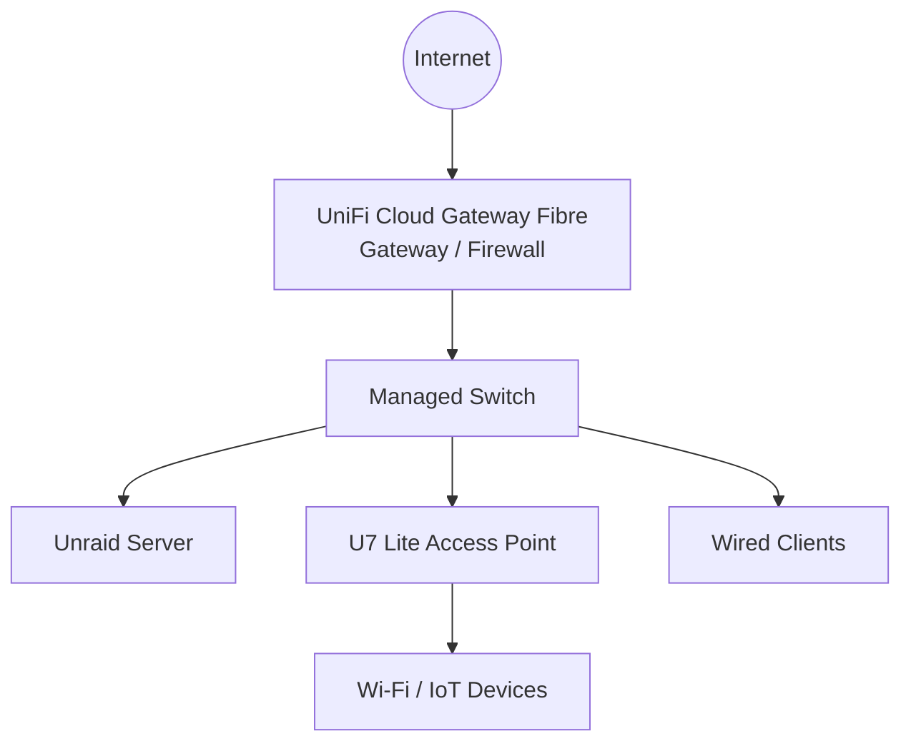
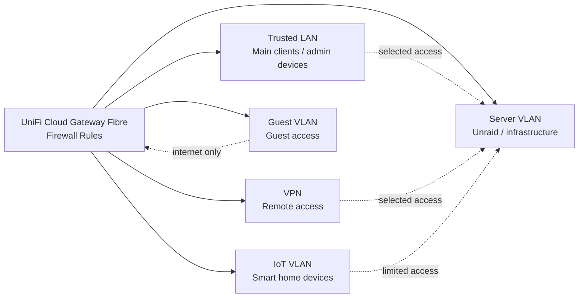

# Network Roadmap

This document describes the planned network improvements for my homelab.

The current setup is still based on a mostly flat home network. It works, but the next goal is to move toward a more structured network design with a dedicated gateway, managed Wi-Fi, VLANs and firewall rules.

## Current State

The homelab currently uses a FRITZ!Box as the main router and gateway.

Remote access is already handled through VPN, so internal services do not need to be exposed directly to the public internet. Internal DNS and reverse proxying are already used for cleaner access to local services.

Current state in short:

- FRITZ!Box as router/gateway
- Unraid server in the local network
- VPN-first remote access
- Internal DNS through AdGuard Home / Unbound
- Internal reverse proxy through Nginx Proxy Manager
- No VLAN segmentation yet

## Planned UniFi Upgrade

The next planned step is a move to UniFi hardware.

| Component | Planned Role |
|---|---|
| UniFi Cloud Gateway Fibre | Gateway, firewall and network controller |
| U7 Lite | Managed Wi-Fi access point |
| Managed switch | Wired network distribution and VLAN transport |
| Unraid server | Server and infrastructure services |

The goal is to replace the current flat network with a setup that can enforce network separation through VLANs and firewall rules.

## Planned Physical Layout

## Planned VLAN Design

The planned VLAN design should separate trusted clients, server workloads, IoT devices and guest devices.

| Zone | Purpose | Planned Access |
|---|---|---|
| Trusted LAN | Main PCs, admin devices and daily clients | Access to selected internal services |
| Server VLAN | Unraid and infrastructure services | Restricted access from trusted networks |
| IoT VLAN | Smart home and IoT devices | Limited access to Home Assistant/MQTT |
| Guest VLAN | Guest devices | Internet-only access |
| VPN | Remote access | Access to selected internal services |

## Planned Logical Layout

## Firewall Direction

The firewall rules should follow a simple principle:

> Allow only what is needed between networks.

Planned direction:

- Trusted clients can access selected server services
- VPN clients can access selected internal services
- IoT devices should only reach Home Assistant/MQTT where required
- Guest devices should only reach the internet
- Management interfaces should be limited to trusted devices
- Server services should not be reachable from every network by default

## Migration Plan

I do not want to change the whole network at once. The migration should happen step by step to avoid breaking working services.

Planned steps:

1. Set up the UniFi Cloud Gateway Fibre
2. Add the U7 Lite access point
3. Rebuild the basic LAN and Wi-Fi setup
4. Create VLANs for trusted clients, servers, IoT and guests
5. Move the Unraid server into the planned network design
6. Add firewall rules gradually
7. Test access to important services
8. Document required ports and exceptions
9. Clean up temporary rules

## Things to Watch During Migration

Possible issues during the migration:

- DNS resolution problems
- Home Assistant discovery issues
- IoT devices not reaching required services
- VPN access needing adjustment
- Reverse proxy hostnames needing updates
- Firewall rules blocking required traffic

Because of that, I want to document the migration while building it instead of only writing down the final state afterwards.

## Next Steps

Planned next steps:

- Deploy UniFi Cloud Gateway Fibre
- Add U7 Lite access point
- Plan VLAN IDs and IP ranges
- Create initial firewall rules
- Move IoT devices into a separate network
- Document required service ports
- Test VPN access after migration
- Add sanitized screenshots once the setup is running

## Summary

The current network is functional, but still simple.

The goal of this roadmap is to move toward a cleaner network design with UniFi, VLANs and firewall rules. I want the setup to stay understandable and maintainable while improving isolation between clients, servers, IoT devices and guest access.
