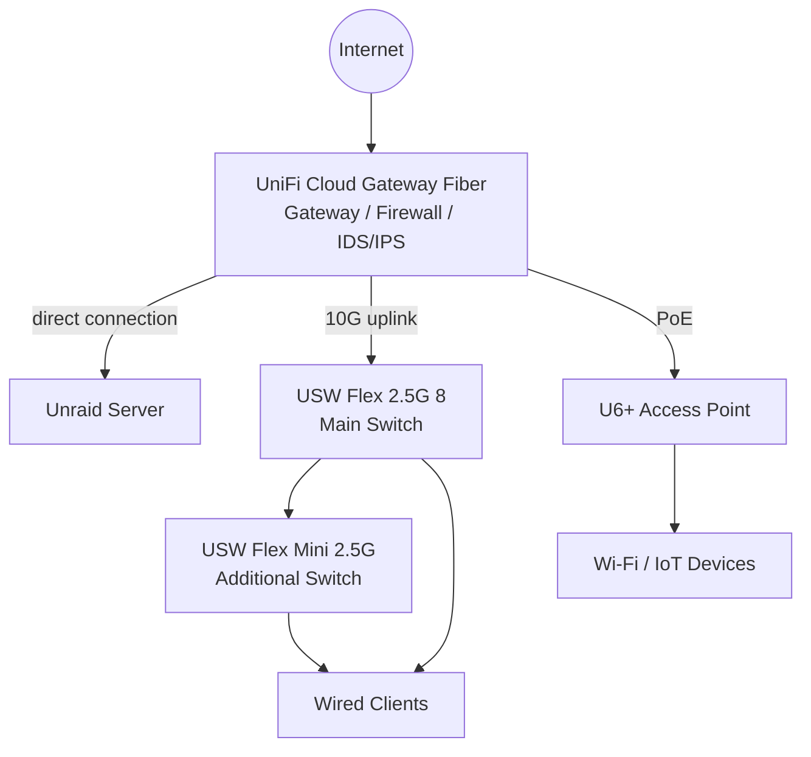
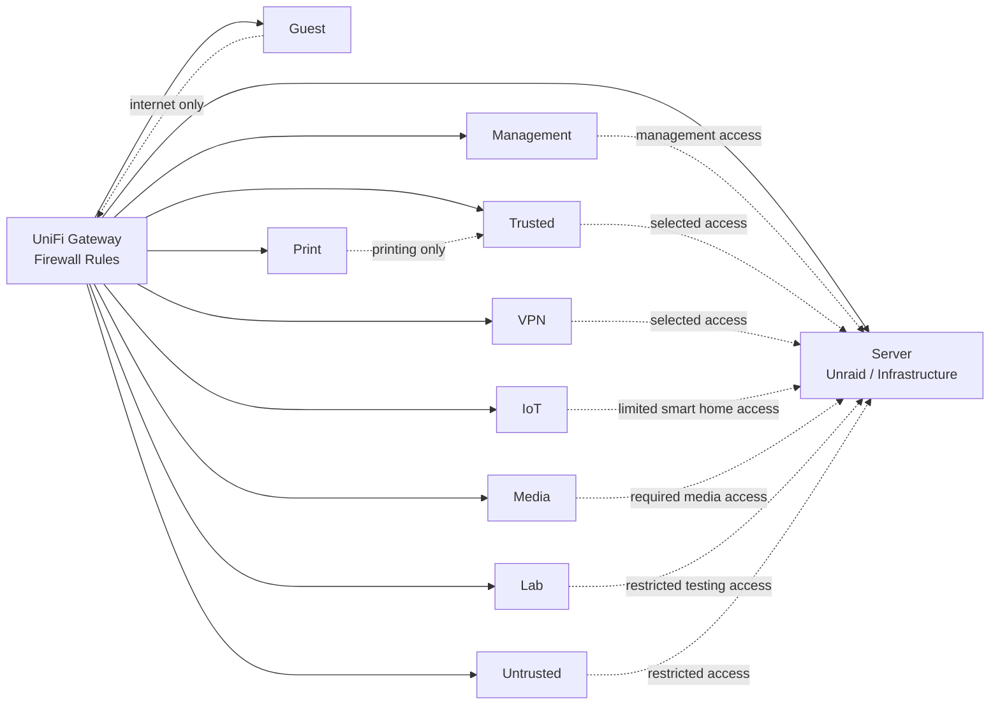

# Network Segmentation

This document describes the current UniFi-based network setup of my homelab.

The network started as a mostly flat home network. I moved it to a segmented setup with a UniFi gateway/firewall, managed switches, separate network zones and firewall rules between them.

The exact internal details are intentionally kept out of the public repository. The important part here is the design and the reasoning behind it.

---

## Current Setup

The current network is built around a UniFi Cloud Gateway Fiber. It handles routing, firewall rules, IDS/IPS and network management.

Remote access is handled through VPN. Internal services are not exposed directly to the public internet by default. For local access I use internal DNS and reverse proxying where it makes sense.

Current state:

- UniFi gateway/firewall is implemented
- network segmentation is implemented
- firewall rules between network zones are implemented
- IDS/IPS is enabled on the UniFi gateway
- Unraid server is connected directly to the gateway
- U6+ access point is connected directly to the gateway via PoE
- main switch is connected to the gateway with a 10G uplink
- internal DNS is handled through AdGuard Home and Unbound
- selected internal access paths use Nginx Proxy Manager

---

## UniFi Network Setup

| Component | Role |
|---|---|
| UniFi Cloud Gateway Fiber | Gateway, firewall, IDS/IPS and network controller |
| Unraid server | Server and infrastructure services, connected directly to the gateway |
| USW Flex 2.5G 8 | Main 2.5G switch, connected to the gateway with a 10G uplink |
| USW Flex Mini 2.5G | Additional 2.5G switch for wired clients |
| U6+ | Managed Wi-Fi access point, connected directly to the gateway via PoE |

The Unraid server is connected directly to the gateway. The main switch uses a 10G uplink to the gateway. The U6+ access point is also connected directly to the gateway via PoE.

---

## Physical Network Layout

---

## Network Zones

I split the network into different zones so that not every device has the same level of trust.

| Zone | Purpose | Access idea |
|---|---|---|
| Default / Native | Compatibility and transition network | Kept as small as practical |
| Management | Network and admin devices | Access to management interfaces |
| Trusted | Main trusted clients and daily-use devices | Access to selected internal services |
| Untrusted | Less trusted client devices | Restricted access to selected services |
| Server | Unraid and infrastructure services | Access only from allowed networks |
| Media | Media and TV devices | Limited access to required media services |
| IoT | Smart home and IoT devices | Limited access where Home Assistant, MQTT or device control requires it |
| Guest | Guest devices | Internet-only access |
| Lab | Testing and lab devices | Separated from normal productive services |
| Print | Printer devices | Only required printing-related access |
| VPN | Remote access | Access to selected internal services |

I try to keep the network simple enough to maintain, while still separating devices that should not fully trust each other.

---

## Logical Network Layout

---

## Firewall Approach

The firewall rules are based on a simple idea: allow the traffic that is required and block unnecessary lateral movement.

Current direction:

- management devices can access required management interfaces
- trusted clients can access selected internal services
- VPN clients can access selected internal services
- server services are not reachable from every network by default
- IoT devices are limited to required smart home communication
- media devices only get the access they need
- printer access is limited to printing-related traffic
- guest devices are intended for internet-only access
- lab devices are separated from normal productive services where possible
- untrusted devices are not treated like trusted clients

When I add an exception, I want to be able to understand later why it exists. That is the main reason I document the rule direction instead of just relying on the UniFi UI.

---

## Gateway Security

IDS/IPS is enabled on the UniFi gateway.

I use it as an additional visibility layer, not as a replacement for segmentation, updates, backups or careful service exposure. The setup should still work securely even without relying on IDS/IPS as the only protection mechanism.

What I use it for:

- spotting suspicious traffic
- getting additional visibility into network activity
- reviewing alerts when something looks unusual
- learning how the network behaves over time

This is still a homelab, so I try to keep the setup realistic and maintainable instead of pretending it is an enterprise SOC.

---

## Notes and Open Points

The network is already segmented and usable, but I still want to improve the documentation around it.

Things I want to keep track of:

- which zones are allowed to access which services
- which services require exceptions
- which ports are actually needed
- which rules were only created for testing
- how DNS and reverse proxying interact with the segmented network
- IDS/IPS findings that are worth reviewing
- troubleshooting notes, for example printer discovery or IoT access issues

More details: [Security Concept](security-concept.md)
